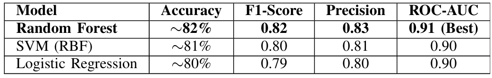

# Placebo Response Prediction using Machine Learning

Machine Learning research project for predicting placebo responsiveness using psychological, personality, demographic, and clinical trial features.

This work was presented at the **6th IEEE International Conference on Intelligent Technologies (CONIT 2026)** and explores how psychological characteristics influence an individual's likelihood of exhibiting a placebo response through supervised machine learning models.


## Overview

The placebo response is a well-known psychological phenomenon where individuals experience measurable improvements despite receiving an inactive treatment.

The objective of this project is to investigate whether placebo responsiveness can be predicted using machine learning by analyzing psychological traits, personality dimensions, and clinical trial characteristics.

The project evaluates multiple classification algorithms and compares their performance while identifying the psychological variables that contribute most to placebo susceptibility.


## Objectives

- Predict placebo response using psychological and clinical features
- Compare multiple supervised learning algorithms
- Handle class imbalance using SMOTE
- Evaluate models using Stratified 5-Fold Cross Validation
- Analyze feature importance and psychological predictors
- Support explainable AI in clinical decision making


## Dataset

The project utilizes a processed dataset containing approximately:

- **13,750 samples**
- **19 engineered features**
- Binary target variable:
  - Placebo Response (0 / 1)

Features include:

### Demographic
- Age
- Gender

### Psychological Traits
- Optimism
- Stress Level
- Anxiety Level
- Emotional Resilience

### Personality (Big Five)
- Openness
- Conscientiousness
- Extraversion
- Agreeableness
- Neuroticism

### Clinical Trial Information
- Trial Phase
- Enrollment Size
- Treatment Type
- Placebo Controlled
- Condition
- Start Year
- Start Month

> **Note:** The processed dataset used during experimentation is not included in this repository. It was generated during the research process using publicly available datasets along with preprocessing and feature engineering.


## Machine Learning Pipeline

1. Data Collection
2. Data Cleaning
3. Feature Engineering
4. Missing Value Handling
5. Feature Scaling
6. Label Encoding / One-Hot Encoding
7. SMOTE Oversampling
8. Train-Test Split
9. Model Training
10. Hyperparameter Tuning
11. Performance Evaluation
12. Feature Importance Analysis


## Models Used

### Logistic Regression

Used as a baseline linear classifier.


### Random Forest

The best-performing model capable of capturing complex non-linear relationships among psychological variables.


### Support Vector Machine (SVM)

Implemented with an RBF kernel for non-linear classification.


## Results



Random Forest achieved the highest overall performance and was selected as the final prediction model.


## Key Findings

Feature importance analysis identified:

- Optimism
- Emotional Resilience
- Neuroticism
- Stress Level

as the strongest predictors influencing placebo responsiveness.

These findings align with existing psychological literature regarding treatment expectancy and adaptive coping mechanisms.


## Repository Structure

```
Placebo-Effect-project/
│
├── app.py                         # Streamlit application for model prediction
├── main.py                        # Main execution script
├── README.md                      # Project documentation
├── requirements.txt               # Python dependencies
├── .gitignore                     # Git ignored files configuration
│
├── data/
│   └── PLACEHOLDER.txt            # Placeholder for dataset directory
│
├── models/
│   ├── __init__.py
│   ├── quicktrain.py               # Quick model training script
│   ├── quick_training_summary.csv
│   ├── quick_training_summary.txt
│   └── PLACEHOLDER.txt
│
├── src/
│   ├── __init__.py
│   ├── preprocessing.py            # Data preprocessing pipeline
│   ├── train_model.py              # Model training pipeline
│   ├── evaluate_model.py           # Model evaluation functions
│   ├── predict.py                  # Prediction utilities
│   └── eda.py                      # Exploratory data analysis
│
└── reports/
    ├── final_report.md             # Project analysis report
    ├── cv_results.csv              # Cross-validation results
    ├── tuning_results.csv          # Hyperparameter tuning results
    ├── quick_model_results_summary.csv
    │
    └── figures/
        ├── Age Distribution of Placebo Response.jpg
        ├── Confusion Matrices.jpg
        ├── Correlation Heatmap.jpg
        ├── Distribution of Psych traits.jpg
        ├── Feature Correlation.jpg
        ├── Placebo Response Analysis Graphs.jpg
        ├── Results.jpg
        └── ROC Curves Comparison.jpg
```

*(Repository structure may vary depending on uploaded files.)*


## Technologies Used

- Python
- Scikit-learn
- Pandas
- NumPy
- Matplotlib
- imbalanced-learn (SMOTE)
- Joblib
- Jupyter Notebook


## Evaluation Metrics

- Accuracy
- Precision
- Recall
- F1-Score
- ROC-AUC
- Stratified 5-Fold Cross Validation


## Research Publication

**Analyzing Psychological Factors Influencing Placebo Response Using Machine Learning**

Presented at:

**6th IEEE International Conference on Intelligent Technologies (CONIT 2026)**

KLE Institute of Technology, Hubballi, India


## Future Work

Future improvements include:

- Real-world clinical validation
- Integration of neuroimaging and genetic biomarkers
- Deep learning models
- Streamlit-based prediction dashboard
- Explainable AI techniques such as SHAP and LIME


## Authors

- Pranav Krishna Y
- Potnuru Koushik

## Results Visualization

### Model Performance Comparison


### ROC Curve Analysis


### Confusion Matrices


### Correlation Heatmap


### Feature Correlation


### Age Distribution of Placebo Response


### Distribution of Psychological Traits


## Citation

If you reference this work, please cite the corresponding IEEE CONIT 2026 paper.